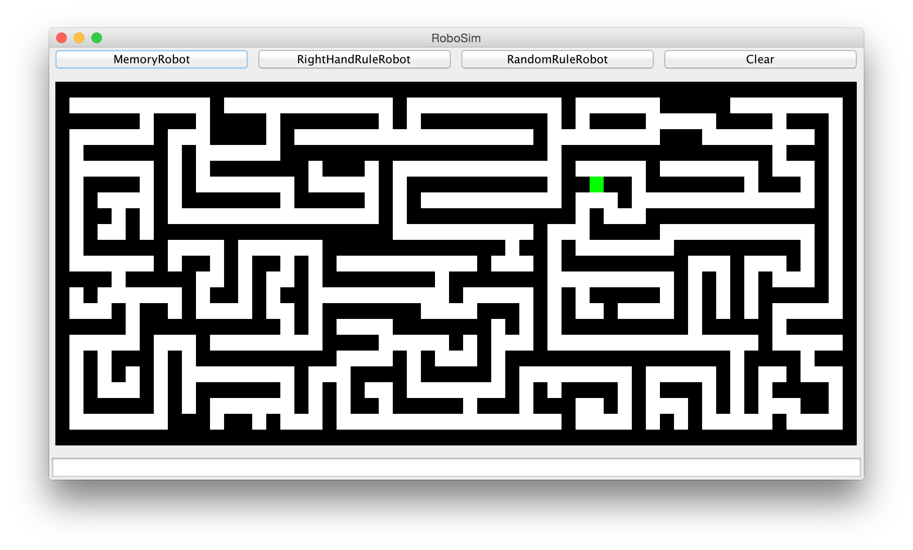

# Maze

This project is an exercise in a course in Java held at Umeå Universit of Sweden.

# How it works
After fireing up the applikation u select a map which can be created using # as wals and blank spaces as paths, S for start and G for goal eg:

and the resulting maze:

 
 You the choose which kind of robot you want to use and send it out in the mase and watch is try to find the Goal.
 
 
 
 
 When the robot reaches the Goal the nummber of steps is displayed.
